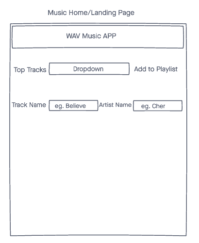
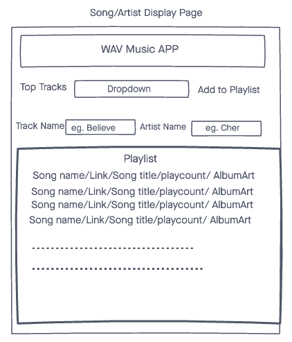

# WAVe Music Playlist App.

1. A simple web app that to help keep track of your groceries.
2. Create a Grocery List by entering your list name on the Create Grocery list Page.
3. Add grocery Items to the Drop-Down by adding them in the Add Grocery Items page.
4. View all created Grocery lists Created on the Grocey list show page.
5. Click on Grocery list name to add items from the Drop-down to your list.
7. There are options at the top of the page to take you home and to various other pages.

##  Getting Started. 🏎💨 

[click here](https://groceries-app-bawa.herokuapp.com/) to get started. 

##  Technologies Used. ⚙️
- CSS
- HTML
- JavaScript
- Express
- MongoDB
- Mongoose
- Github
- Heroku for deployment.

##  Screenshots and Wireframes. 📸

##  Future Enhancements. 🛠

- Fix price total when you add items to list.
- Minor UI tweeks.
- Possible Animations.
- Add ability to log in.
